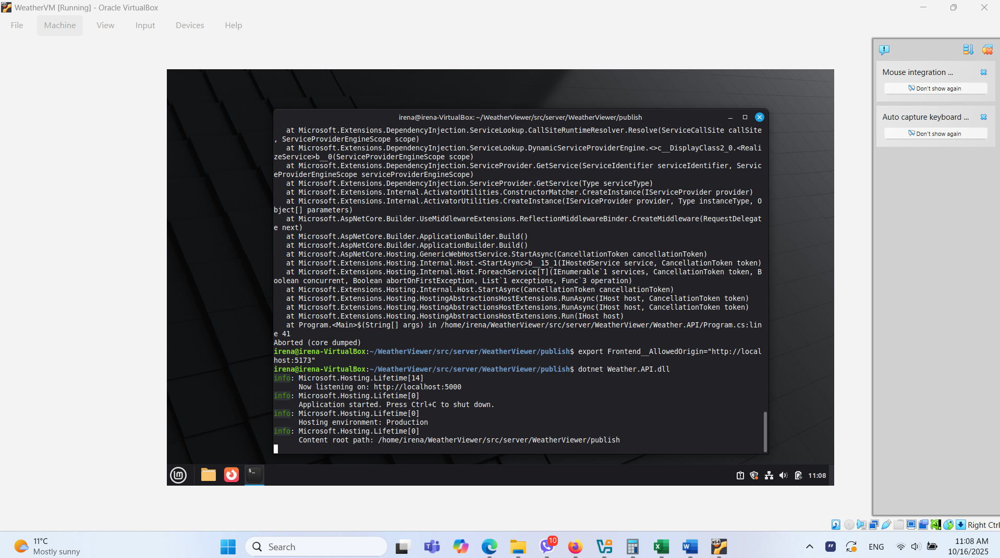

# Weather Viewer

Weather Viewer is a minimal but functional weather application built with **.NET 8 Web API** and a **React frontend** using OpenStreetMap/Leaflet. The backend runs inside a **Linux Mint VM** on VirtualBox.

> ⚠️ Note: For this implementation, I used **OpenWeather Web API 2.5** (instead of One Call 3.0) as it is free. This results in minor differences in JSON property names.

---

## 🖥 Project Architecture

The system consists of three main parts:

1. **Linux VM**

   - Linux Mint running inside VirtualBox.
   - .NET 8 Runtime installed.
   - Network configured with NAT + Port Forwarding, so the API is accessible from the host machine.

2. **.NET 8 Web API (WeatherApi)**
   - Endpoint: `GET /weather?lat={lat}&lon={lon}` - Returns current weather for given coordinates.
   - Health check endpoint: `GET /health`
     > Implementation note: Health check calls the OpenWeather API using Sofia coordinates.
   - API key stored in `appsettings.json` (not exposed in code).
   - Minimal validation - Returns **HTTP 400** for invalid coordinates.

- Returns simplified JSON.

3. **React Frontend**
   - Built with Vite + React.
   - Leaflet map component displays current location (via browser geolocation) or falls back to Sofia if denied.
   - Clicking or dragging the map marker calls the API and displays weather data.
   - Simple loading/error status and minimal UI: map + weather panel.

## My Setup and Workflow of the VM

- **Virtual Machine Setup:**  
  I installed Linux Mint inside a VirtualBox VM named `WeatherVM` with 2 GB RAM and a 25 GB virtual hard disk. Due to limited disk space, I used a USB 2.0 drive, which made the VM slightly slower but fully functional.

- **.NET 8 Installation:**  
  Inside the VM, I installed the .NET 8 SDK to run and publish the API.

- **Repository Setup:**  
  I cloned this repository directly into the VM and published the API for Linux using `dotnet publish`.

- **Running the API:**  
  The API was run inside the VM. Initially, I encountered CORS issues because the frontend host was defined in `appsettings.Development.json`. This was resolved by exporting the allowed origin with:

  ```bash
  export Frontend__AllowedOrigin="http://localhost:5173"
  ```

<p align="left">

</p>

## Future Improvements

This project is currently minimalistic, leaving plenty of opportunities for enhancement. Planned improvements can be grouped into the following categories:

## Features to Add

- Implement a **5-day weather forecast**, in addition to current weather (requires One Call 3.0 and updates to the DTOs).
- Add a **search bar** to allow users to find cities easily.
- Display the **place name** alongside latitude and longitude when positioning map pins.

## 🗺️ Map

- Introduce **JWT-based authentication** to allow users to **save and manage favorite locations**.
- Support **multiple map pins**, each displaying relevant weather information.

---

## 🏗️ Technical Enhancements

- **Dockerize** the application, including both the React frontend and .NET API backend.
- Deploy the application to **cloud platforms** such as Azure or AWS for public access.

---

## 🔐 Performance & Reliability

- **Cache weather results** to reduce unnecessary calls to the OpenWeather API.
- Add **unit and integration tests** for the `WeatherService` to ensure reliability.
- Implement **retry policies** with Polly to handle cases when the weather API is temporarily unavailable.
